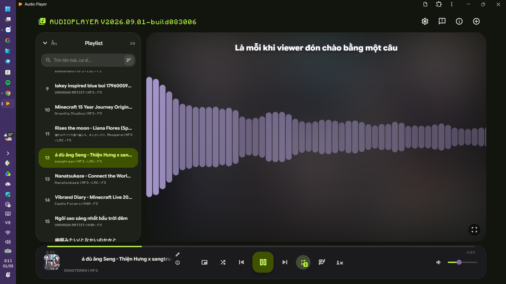
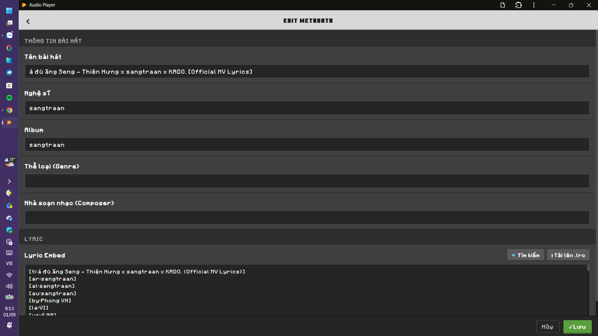
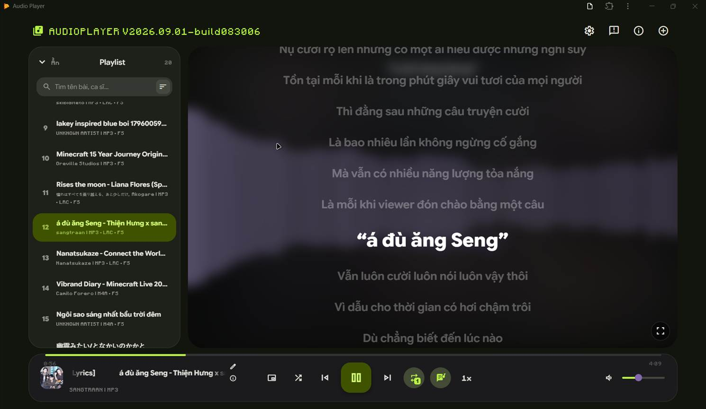

# 🎵 Audio Player

> A modern, smooth, and feature-rich local (client-side) audio player built on top of **Material Design 3 Expressive**. Experience high-quality music playback directly in your browser without complex software installation or privacy concerns.

---

## 📸 Experience

* 🌐 **Live App:** [Audio Player](https://tuanphong3108.github.io/music-player/) *(Works 100% Offline after loading)*

---

## Preview

---

## 🌟 Key Features

### 🎧 Audio Player & Playlist Management
* **100% Offline & Client-side:** All tracks, metadata, and lyrics are processed directly on your device, ensuring maximum privacy.
* **Drag & Drop:** Quickly add tracks or entire music folders with simple drag-and-drop actions.
* **PWA Support (Progressive Web App):** Install directly onto Windows, Android, or macOS as a standalone app, supporting native file opening.
* **Smart Filter & Search:** Lightning-fast searching across songs, artists, and albums with automatic diacritics and special character stripping.

### 📝 Powerful MP3 Tag & Metadata Editor
* **Direct Editing:** Effortlessly modify Song Title, Artist, Album, Genre, Release Year, and Lyrics.
* **Cover Art Management:** View, download, replace, crop to square, or rotate album artwork directly.
* **Real File Overwriting:** Integrated with the *File System Access API* to save and overwrite updated ID3 tags directly back to `.mp3` files on your storage without downloading new copies.

### 🎤 Synchronized Lyrics & View Modes
* **Karaoke Sync (LRC Format):** Real-time lyric synchronization and auto-scrolling with smooth visual effects.
* **Picture-in-Picture (PiP):** Floating media window support to monitor playback/cover art while working in other apps.
* **Full Screen Mode:** Minimalist full-screen view designed to keep your focus on the music and visualizer.

### 🎨 Design & Performance Optimized
* **Material Design 3 Expressive:** Modern aesthetics featuring dynamic dynamic colors, rich interactions (Ripple Effects, Overshoot Animations).
* **Flexible Theme Modes:** Dark, Light, or System Auto-matching modes.
* **Low-end Device Optimization:** Options to toggle motion effects (*Reduce Motion*) and disable background blurs (*Blur Effect*) for fluid performance across all hardware.

---

## ⌨️ Keyboard Shortcuts

| Shortcut | Action |
| :--- | :--- |
| **`Space`** | Play / Pause playback |
| **`←` / `→`** | Seek backward / forward 5 seconds |
| **`Ctrl` + `←` / `→`** | Previous / Next track |
| **`↑` / `↓`** | Volume Up / Down by 5% |
| **`Ctrl` + `O`** | Open file picker dialog |
| **`M`** | Mute / Unmute audio |
| **`F11`** | Toggle Full Screen mode |

---

## 🛠️ Built With

* **UI Framework & Core:** HTML5, Tailwind CSS, Google Sans Flex Font.
* **Design System:** Material Web Components (`@material/web` - MD3 Expressive).
* **Metadata Processor:** `jsmediatags` (read ID3 tags) & `browser-id3-writer` (write & edit ID3 tags).
* **Audio Engine:** Web Audio API & HTML5 Audio.

---

## 🚀 Installation Guide

No Node.js or complex build tools required! You can run and install the app in seconds:
- Visit [Audio Player](https://tuanphong3108.github.io/music-player/)
- Look next to the Settings button in the top bar for the Install icon
- Click the **Install** icon > Confirm Install
- Done! You can now use it natively offline.

---

## 📝 License

Distributed under the [MIT License](https://github.com/Tuanphong3108/music-player/blob/main/LICENSE).

Built with ❤️ by [Phong VN](https://tuanphong3108.github.io).